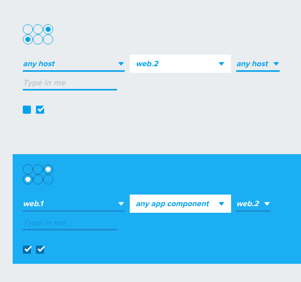

## Lexi
Drop in replacement for prettier form elements.



## Usage

###### HTML (jade):
```jade
# Radio Buttons
input.lexi(value="1st" type="radio" name="group1")
input.lexi(value="2nd" type="radio" name="group1")
input.lexi(value="3rd" type="radio" name="group1" checked="checked")

# Basic Select
select.lexi
  optgroup(label="General Types")
    option(value="any-hosts") any host
    option(value="any-appComponents") any app component
    option(value="any-platformComponents") any platform component
  optgroup(label="Specific Types")
    option(value="web.1") web.1
    option(value="web.2") web.2
    option(value="web.3") web.3

# Select with white background
select.lexi.white
  optgroup(label="General Types")
    option(value="any-hosts") any host
    option(value="any-appComponents") any app component
    option(value="any-platformComponents") any platform component
  optgroup(label="Specific Types")
    option(value="web.1") web.1
    option(value="web.2") web.2
    option(value="web.3") web.3

# Blue Theme
.lexi-blue # (any parent element)
  input.lexi(type="checkbox" checked="true")
```

###### javascript:
```javascript
// Replace all elements with `lexi` class
lexify()

// Replace elements in a jquery context
lexify( $('.just-this-element') )

// Add event listeners as if lexi was not used
$('select').on( 'change', function(e){
  // do something
})
```

## Caveats
- Currently require jquery.
- Currently require jade for templating.
